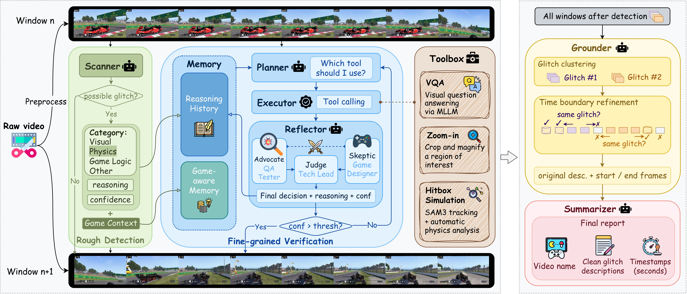

# BugAgent - Glitch Detection in Gameplay Videos

A LangGraph-based multimodal LLM pipeline for automated video game glitch detection.

---

## Architecture



BugAgent processes a video through five sequential stages:

- **Preprocess** — Extracts frames at a fixed FPS (default 4 fps) and stitches them into windows (default 8 frames per window) for downstream processing.
- **Scanner** — Runs a fast initial screening over every window to produce a glitch hypothesis (`has_glitch`, `category`, `confidence`) and a `game_context` description used as a RAG-like knowledge base by later stages.
- **Analyzer** — For windows flagged by the Scanner, runs an iterative investigation loop: a **Planner** selects the next tool, an **Executor** runs it, and a **Reflector** evaluates the result via an adversarial debate between an **Advocate** (game test engineer, argues for glitch), a **Skeptic** (game designer, argues for normal behavior), and a **Judge** (tech lead, makes the ruling).
- **Grounder** — Clusters analysis results across windows, merges adjacent occurrences of the same glitch, and performs bidirectional temporal boundary refinement.
- **Summarizer** — Converts grounded glitch records into the final report, translating frame indices to timestamps and using an LLM to produce clean, coherent descriptions.

---


## Tools

| Tool | Status | Description |
|------|--------|-------------|
| `vqa` | Active | Visual QA on the full stitched window image via MLLM |
| `zoom_in` | Active | Crop and magnify a region of interest, then run VQA |
| `object_tracking` | Optional | Frame-by-frame SAM3 tracking + automatic physics analysis (requires SAM3 installation) |

`object_tracking` is lazily initialized. SAM3 is only loaded on the first call, and the tool disables itself gracefully if SAM3 is not installed.

---

## Quick Start

### 1. Install dependencies

```bash
pip install -r requirements.txt
```

### 2. Run with a local vLLM server

```bash
# Start vLLM first:
# vllm serve Qwen/Qwen2.5-VL-7B-Instruct --port 8000

python run.py --video data/videos/video_name.mp4
```

### 3. Run with OpenAI

```bash
python run.py \
    --video data/videos/video_name.mp4 \
    --api-key $OPENAI_API_KEY \
    --api-base https://api.openai.com/v1 \
    --model gpt-4o \
    --game-name "GTA V"
```

---

## Output

The final report is saved to `{output_dir}/results/{video_name}_report.json`:

```json
{
  "video_name": "haj831",
  "game_name": "GTA V",
  "no_bugs": false,
  "bugs": [
    "A red sports car is floating above the road surface near the highway overpass, with no visible support or propulsion."
  ],
  "time_nodes": [
    [[12, 15], [23, 24]]
  ]
}
```

`time_nodes[i]` is a list of `[start_sec, end_sec]` intervals for bug `i`.

---

## LangGraph Flow

BugAgent uses [LangGraph](https://github.com/langchain-ai/langgraph)'s `StateGraph` to wire the pipeline together. Each stage is a **node** that reads from and writes to a shared `BugAgentState` TypedDict. State is passed immutably between nodes — each node returns only the keys it updates.

The edge from `scanner_node` is **conditional**: if no glitches were found, the graph skips directly to `summarizer_node`, avoiding unnecessary analyzer and grounder calls.

```
preprocess_node → scanner_node
                       │
                       ├── (has glitches) ──► analyzer_node ──► grounder_node ──► summarizer_node
                       │
                       └── (no glitches) ────────────────────────────────────► summarizer_node
```

---

## Configuration Reference

```python
from config import BugAgentConfig

cfg = BugAgentConfig(
    output_dir="data",
    verbose=True,
    save_intermediate=True,   # saves scan/analysis/grounded JSONs to data/intermediate/
)

cfg.llm.api_key    = "EMPTY"
cfg.llm.api_base   = "http://localhost:8000/v1"
cfg.llm.model      = "Qwen/Qwen2.5-VL-7B-Instruct"
cfg.llm.temperature = 0.3
cfg.llm.max_tokens  = 1024
cfg.llm.timeout     = 120

cfg.preprocess.target_fps    = 4.0   # frames/sec to extract
cfg.preprocess.window_size   = 8     # frames per stitched window
cfg.preprocess.window_overlap = 0

cfg.scanner.temperature = 0.3
cfg.scanner.max_tokens  = 512

cfg.analyzer.max_iterations      = 5     # max Planner→Executor→Reflector cycles
cfg.analyzer.confidence_threshold = 0.70 # stop when Judge reaches this confidence

cfg.grounder.frames_per_window = 8  # must match preprocess.window_size

cfg.summarizer.fps = 4.0   # must match preprocess.target_fps
```